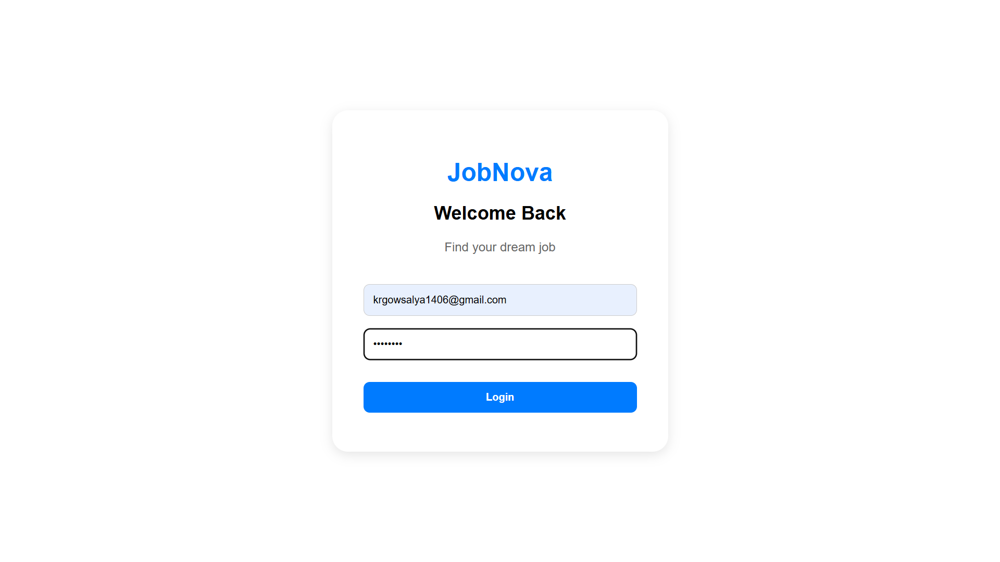
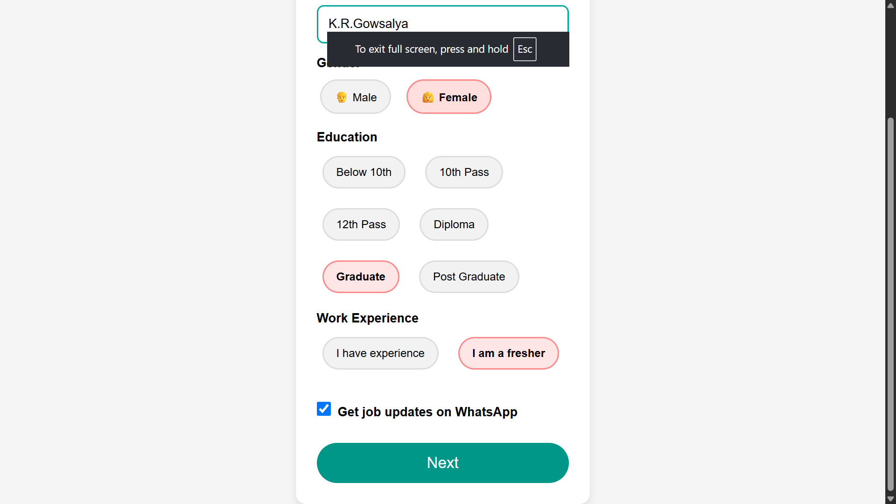
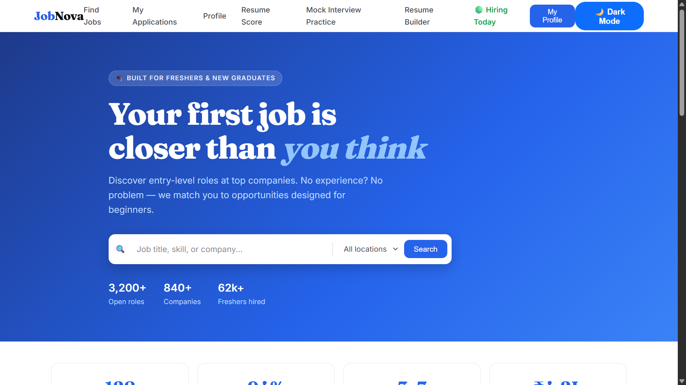
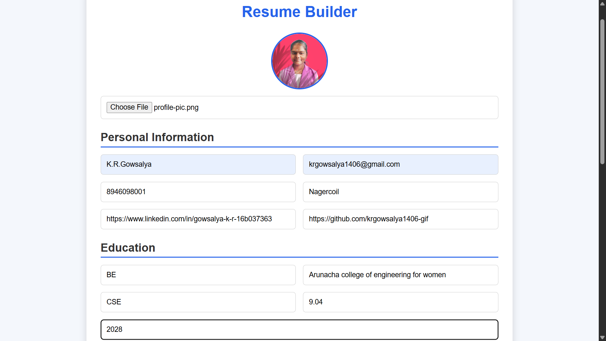
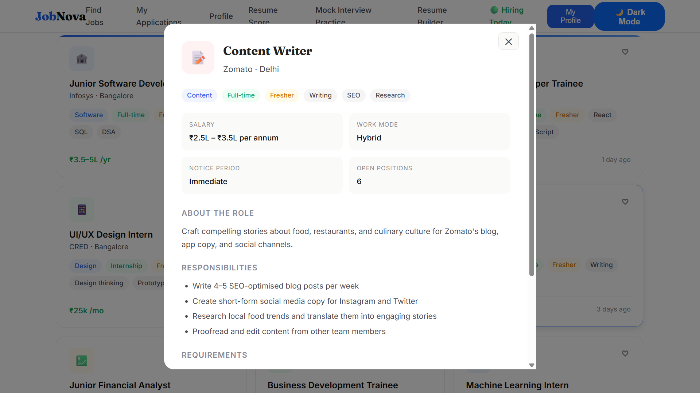
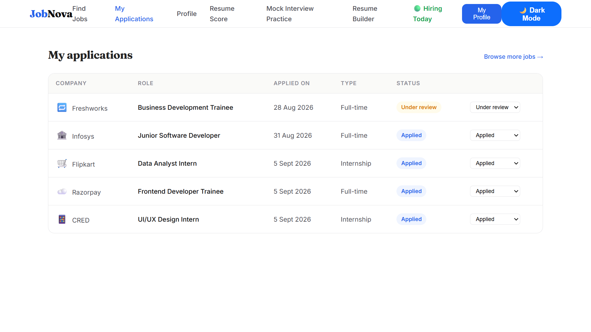
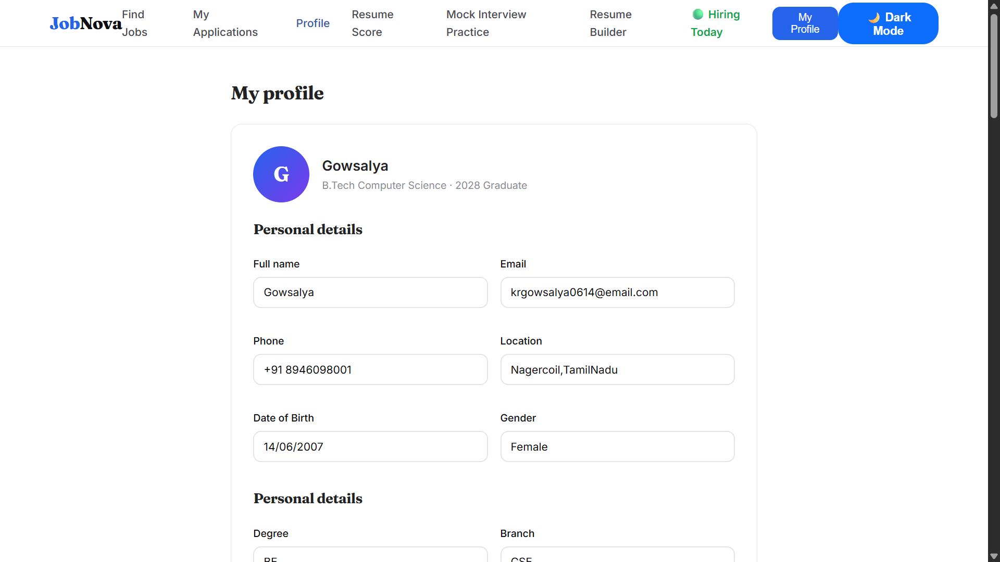
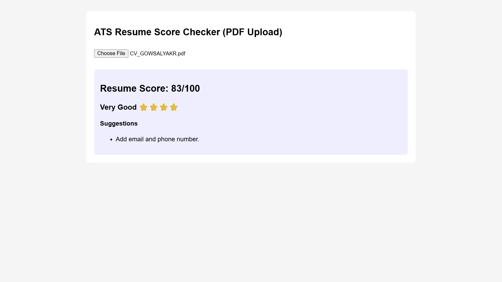
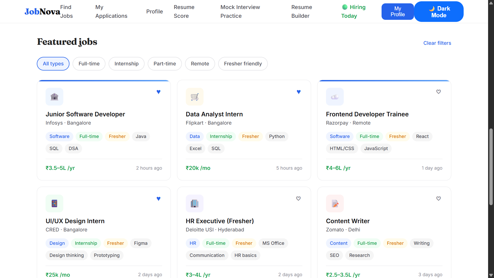
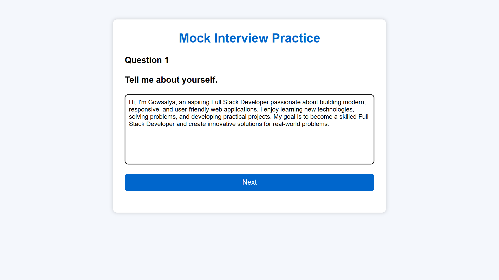

# 💼 Online Job Portal

A modern and user-friendly **Online Job Portal** developed using HTML, CSS, and JavaScript. The platform helps job seekers discover suitable job opportunities, search and filter jobs by location, save jobs, create professional resumes, check resume scores, apply for jobs, and track their applications from one place.

The project also includes **My Profile, Mock Interview, Dark Mode, and Job Notifications**, providing a complete and efficient job-search experience through a clean, responsive, and interactive interface.

## 🎯 Project Objective

The main objective of this project is to create a simple and efficient platform that helps job seekers search for suitable jobs, build resumes, apply for opportunities, and track their applications in one place.

## ✨ Features

🔐 User Login & Registration

🏠 Personalized Dashboard

🔍 Smart Job Search

🎯 Advanced Job Filters

📍 Location-Based Job Search

💼 Job Listings & Job Details

❤️ Save / Bookmark Jobs

📄 Resume Builder

📝 Apply for Jobs

📊 Resume Score & Analysis

📋 My Applications

👤 My Profile

🎤 Mock Interview

🌙 Dark Mode

🔔 Job Notifications


## 🎥 project Demo


[Project Demo](https://drive.google.com/file/d/1g8423RMjPp7ByNngiQ1SyIG-OD-J0ay1/view?usp=drive_link)

## 🎥 project Demo
[Live Demo](https://krgowsalya1406-gif.github.io/Online-Job-Portal/web.html)


## 📸 Screenshots

### 🔐 Login Page
A clean and responsive login page that allows users to securely access their Online Job Portal account using their email and password.


### 📝 Create Account
A simple and responsive registration page that allows new users to create an account by entering their personal details, email address, and password. It includes form validation and a user-friendly interface for easy registration.




### 🏠 Job Portal Dashboard
A personalized dashboard that provides users with quick access to jobs, applications, saved jobs, and profile information.



### 📄 Resume Builder
A user-friendly tool that helps users create professional resumes by adding their personal details, education, skills, and experience.




### 📝 Apply for Job
A simple page that allows users to view and track the jobs they have applied for.



### 📋 My Applications
A smart application tracker that helps users monitor applied jobs, application status, and interview progress in one place.




### 👤 Profile
A personalized profile page where users can manage their personal details, skills, education, experience, and professional information.



### 📊 Resume Score
A smart tool that analyzes a resume and provides a score with suggestions to improve its quality and job relevance.



⭐ Featured Jobs

A curated section that highlights popular and relevant job opportunities based on user interests and skills.



🎤 Mock Interview

A practice interview feature that helps users prepare for real interviews by answering common questions and improving their confidence.




## 📁 Project Structure

```text
📁 job-portal
│
├── 📄 index.html
├── 📄 builder.html
├── 📄 introduce.html
├── 📄 dashboard.html
├── 📄 jobs.html
├── 📄 resume.html
├── 📄 applications.html
├── 📄 profile.html
├── 📄 mock.html
├── 📄 web.html
│
├── 🎨 style.css
├── 🎨 introduce.css
├── 🎨 location.css
│
├── ⚙️ script.js
├── ⚙️ introduce.js
├── ⚙️ location.js
│
└── 📁 image
    │
    ├── 🖼️ create.png
    ├── 🖼️ dashboard.png
    ├── 🖼️ featuredjob.png
    ├── 🖼️ interview.png
    ├── 🖼️ location.png
    ├── 🖼️ login.png
    ├── 🖼️ myapplication.png
    ├── 🖼️ profile.png
    ├── 🖼️ resumebuilder.png
    └── 🖼️ resumescore.png
```


## 🛠 Tech Stack

* HTML5
* CSS3
* JavaScript

## 🌟 Project Highlights

* Simple and intuitive user experience
* Responsive across desktop, tablet, and mobile
* Organized job-search workflow
* Interactive application tracking
* Professional resume-building feature
* Beginner-friendly frontend implementation
* Clean and maintainable code structure

## 📈 Future Enhancements

* 🤖 AI-powered job recommendations
* 💬 Recruiter and candidate chat
* 📧 Email notifications
* 🏢 Recruiter dashboard
* 📊 Admin dashboard
* ☁️ Cloud database integration
* 🔎 Advanced job filtering
* 🤖 AI Resume Analyzer
* ⭐ Job and company reviews

## 📬 Contact

 ✨ Crafted with ❤️ by K.R. Gowsalya

Like the project? ⭐ Star it, explore it, and keep building!


