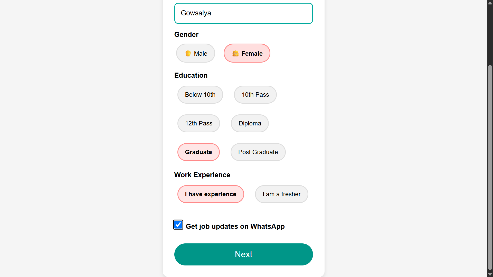

# 💼 Online Job Portal

A modern and user-friendly **Online Job Portal** developed using HTML, CSS, and JavaScript. The platform helps job seekers discover suitable job opportunities, search and filter jobs by location, save jobs, create professional resumes, check resume scores, apply for jobs, and track their applications from one place.

The project also includes **My Profile, Mock Interview, Dark Mode, and Job Notifications**, providing a complete and efficient job-search experience through a clean, responsive, and interactive interface.

## ✨ Features

🔐 User Login & Registration

🏠 Personalized Dashboard

🔍 Smart Job Search

🎯 Advanced Job Filters

📍 Location-Based Job Search

💼 Job Listings & Job Details

❤️ Save / Bookmark Jobs

📄 Resume Builder

📝 Apply for Jobs

📊 Resume Score & Analysis

📋 My Applications

👤 My Profile

🎤 Mock Interview

🌙 Dark Mode

🔔 Job Notifications


## 🎥 project Demo


[Project Demo](https://drive.google.com/file/d/1g8423RMjPp7ByNngiQ1SyIG-OD-J0ay1/view?usp=drive_link)


## 📸 Screenshots

### 🔐 Login Page
A clean and responsive login page that allows users to securely access their Online Job Portal account using their email and password.

### 📝 Create Account




### 🏠 Job Portal Dashboard

Add your dashboard screenshot here.

### 🔍 Job Search

Add your job-search screenshot here.

### 📄 Resume Builder

Add your resume-builder screenshot here.

### 📝 Apply for Job

Add your job-application screenshot here.

### 📋 My Applications

Add your application-tracking screenshot here.

### 👤 Profile

Add your profile page screenshot here.

## 📁 Project Structure

```text
📦 online-job-portal
│
├── 📄 index.html
├── 📄 login.html
├── 📄 register.html
├── 📄 dashboard.html
├── 📄 jobs.html
├── 📄 resume.html
├── 📄 applications.html
├── 📄 profile.html
│
├── 🎨 style.css
├── ⚙️ script.js
│
└── 📁 assets
    ├── images
    └── icons
```

## 🛠 Tech Stack

* HTML5
* CSS3
* JavaScript
* Responsive Web Design
* LocalStorage

## ⚙️ How to Use

1. Clone the repository.
2. Open the project folder in VS Code.
3. Open `index.html`.
4. Run the project using **Live Server**.
5. Register or log in to the portal.
6. Search for available jobs.
7. View job details.
8. Create or update your resume.
9. Apply for suitable jobs.
10. Track your applications from **My Applications**.

## 🎯 Main Modules

### 🔐 Authentication

Users can register and log in to access their personalized job portal.

### 🔍 Job Search

Users can search and filter jobs based on job title, company, location, and other criteria.

### 📄 Resume Builder

Users can create and manage a professional resume directly inside the portal.

### 📝 Job Application

Users can apply for available job opportunities using their profile and resume.

### 📋 Application Tracking

Users can view their submitted applications and monitor their application status.

### 👤 Profile Management

Users can update their personal information, skills, education, experience, and resume.

## 🌟 Project Highlights

* Simple and intuitive user experience
* Responsive across desktop, tablet, and mobile
* Organized job-search workflow
* Interactive application tracking
* Professional resume-building feature
* Beginner-friendly frontend implementation
* Clean and maintainable code structure

## 📈 Future Enhancements

* 🤖 AI-powered job recommendations
* 💬 Recruiter and candidate chat
* 📧 Email notifications
* 🏢 Recruiter dashboard
* 📊 Admin dashboard
* ☁️ Cloud database integration
* 🔎 Advanced job filtering
* 🤖 AI Resume Analyzer
* ⭐ Job and company reviews

## 📬 Contact

Developed with ❤️ by **KR Kaushalya**

If you find this project useful, feel free to ⭐ the repository and explore the project.


